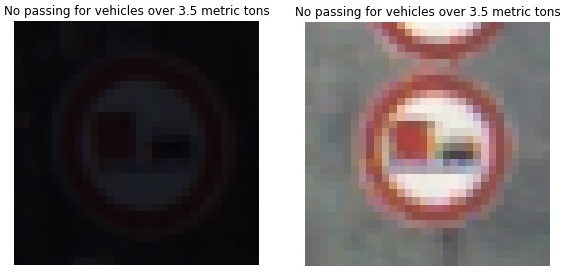
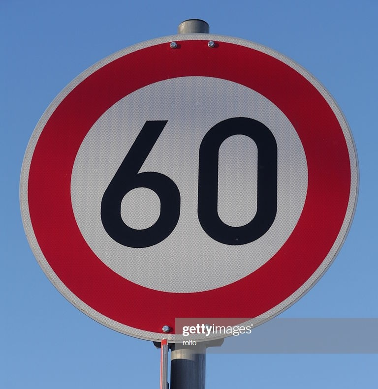
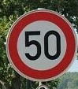
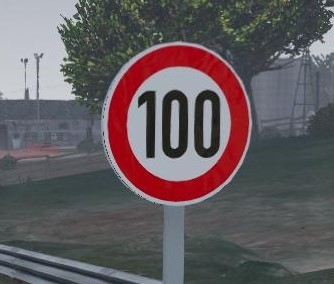
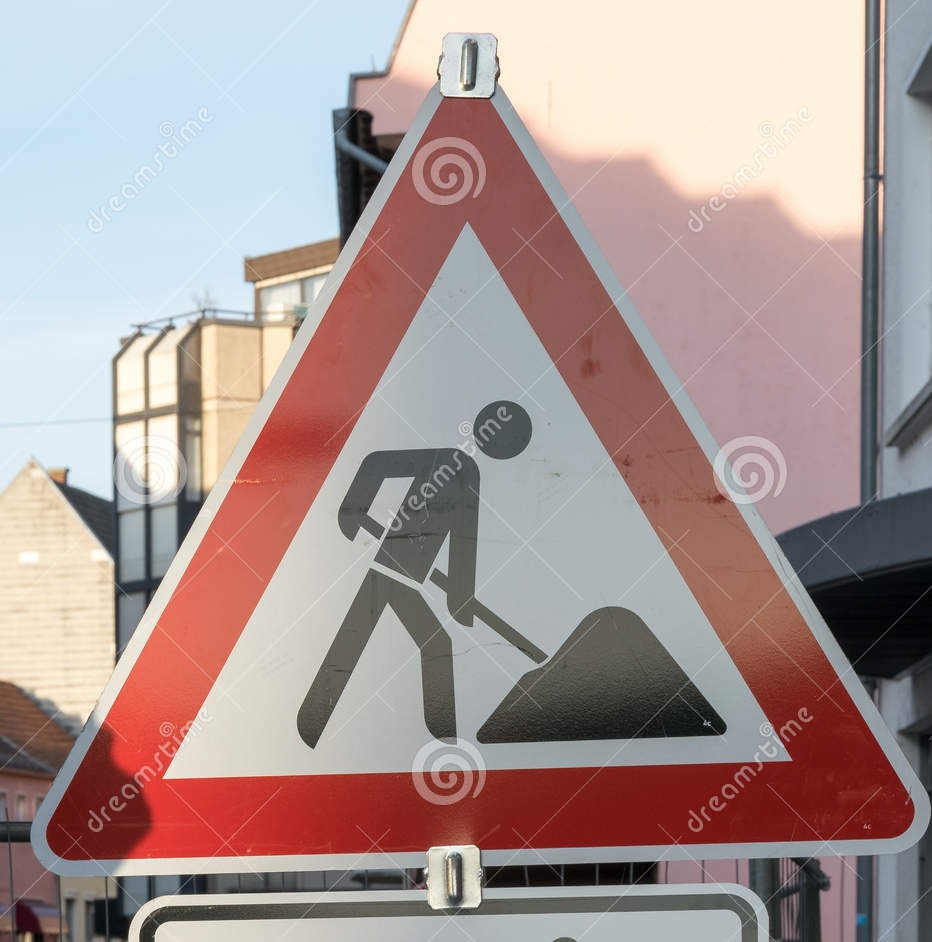
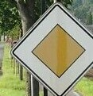
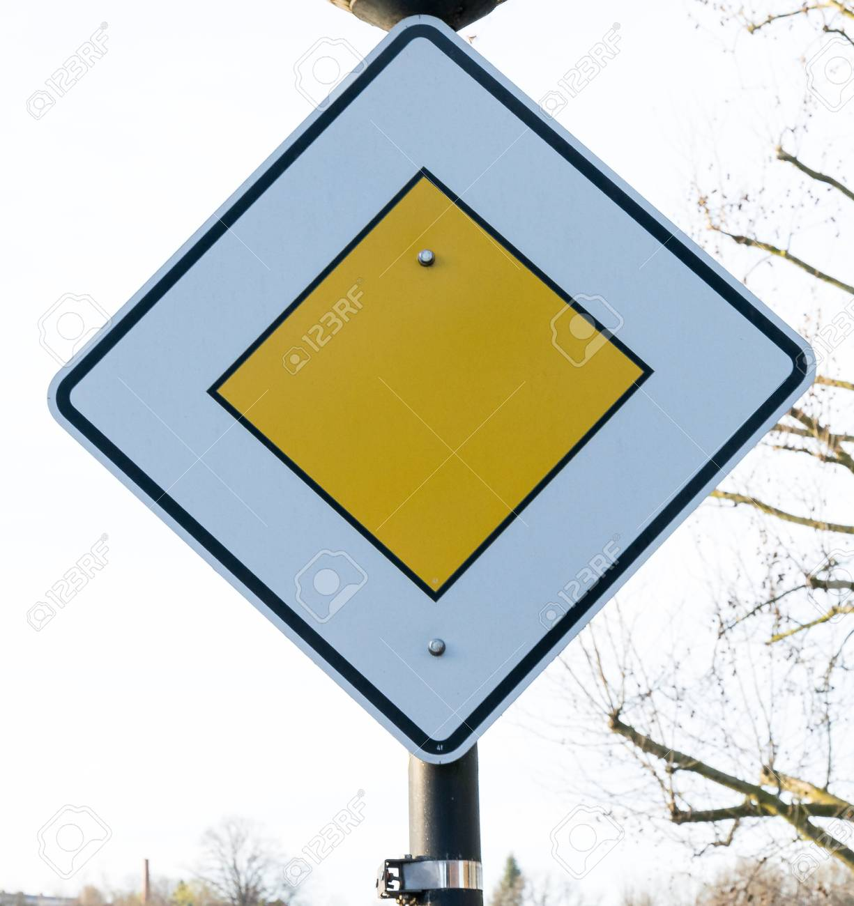
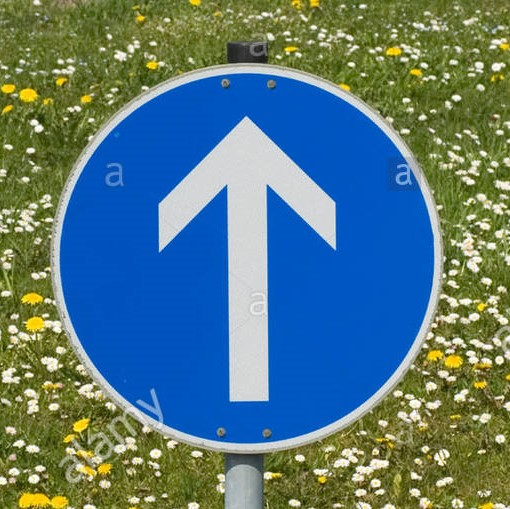

# **Traffic Sign Recognition** 

---

**Build a Traffic Sign Recognition Project**

The goals / steps of this project are the following:
* Load the data set (see below for links to the project data set)
* Explore, summarize and visualize the data set
* Design, train and test a model architecture
* Use the model to make predictions on new images
* Analyze the softmax probabilities of the new images
* Summarize the results with a written report

[//]: # (Image References)

[image1]: ./Data/visualization.jpg  "Visualization"

[image3]: ./Data/Sample-Normalized.jpg "Normalized"
[image4]: ./Data/Speed_limit_60.jpg "Traffic Sign 1"
[image5]: ./Data/speed_limit_50.jpg "Traffic Sign 2"
[image6]: ./Data/speed_limit_100.jpg "Traffic Sign 3"
[image7]: ./Data/Road_Work.jpg "Traffic Sign 4"
[image8]: ./Data/Priority_Road_2.jpg "Traffic Sign 5"
[image9]: ./Data/Priority_road.jpg "Traffic Sign 6"
[image10]: ./Data/Ahead_Only.jpg "Traffic Sign 7"
  

---

## Data Set Summary & Exploration

#### 1. A basic summary of the data set. In the code, the analysis is done using python.

I used the pandas library to calculate summary statistics of the traffic
signs data set:

* The size of training set is 34799
* The size of the validation set is 4410
* The size of test set is 12630
* The shape of a traffic sign image is 32*32*3
* The number of unique classes/labels in the data set is 43

#### 2. An exploratory visualization of the dataset.

Here is an exploratory visualization of the data set. It is a bar chart showing how the data is distributed accross the training data set.

![alt text][image1]

As we can see, the data set has high samples in some classes and very low samples in other, Take an example "Speed limit 30" Vs "speed limit 100", The variance is very large which might lead in more errors in detection for the latter than the "speed limit 30" as we will see later in the new test images from the german dataset for the traffic sign, the same with the priority road sign as we will see later on.

## Design and Test a Model Architecture

#### 1. Preprocessing the image data.

Preprocessing the image data was one of the main points to consider to have a well trained Model, Many alternatives were tested, like Converting image to gray scale and then normalize using Min/Max, Converting to other color domain **HSL** or **HSL** and normalize the L component to have better illumination to the image, and also another technique was to normalize each component of the image(which came out to be wrong cause it leads to losing the data within the image), Lastly using the OpenCV normalization for arrays tecnique which normalizes the norm or value range of an array.

Here is an example of a traffic sign image before and after applying the CV2. Normalize function.
As we can see, there are some images that had bad illumination and the data within wasn't appearing correctly like in the "no Passing" signs, After applying the preprocessing method choosed the image is highly visible now and can be diffrentiated well from the rest of the signs.

 

In a further improvement steps to add more data to the the data set, Adding some randomised noise and applying other normalization techniques to the training dataset will introduce more generated images from our training data that will make our model robust more to Noise.

#### 2. Final model architecture 

My final model consisted of the following layers:

| Layer         		|     Description	        					|
|:---------------------:|:---------------------------------------------:|
| Input         		| 32x32x3 RGB image   							|
| Convolution 1     	| 1x1 stride, VALID padding, outputs = 28x28x6 	|
| RELU					|												|
| Max pooling	      	| 2x2 stride, VALID padding, outputs = 14x14x6   |
| Convolution 2  	    | 1x1 stride, VALID padding, outputs = 10x10x16  |
| RELU					|												|
| Max pooling	      	| 2x2 stride, VALID padding, outputs = 5x5x16    |
| Flatten				| outputs = 400									|
| Fully connected		| inputs = 400, outputs = 120       	            |
| RELU					|												|
| Fully connected		| inputs = 120, outputs = 84       	            |
| RELU					|												|
| Fully connected		| inputs = 84, outputs = 43       	            |

#### 3. Model Training Parameters.

Here you are the parameters used to train the model as following:

| Parameter        	|  Value			 							|
|:-----------------------------------------------------------------:|:------------------------------------------------------------------:|
| Optimizer			|  Softmax cross entropy with logits			|
| Epochs No.		|  25											|
| Batch Size		|  128											|
| Learning Rate		|  0.005										|

#### 4. Model Approach taken 

Our approach was to use the well knows LENET network which consists of two sets of conv. Relu then Max pooling, followed by 3 fully connected layers.

These layers was later on introduced to each image through logits and diffrentiated using the Softmax cross entropy function to 

The data set was split into 3  parts to cover the Training, Validation and Testing parts
Here you are the final model results as following:
* training set accuracy of 0.99
* validation set accuracy of 0.94
* test set accuracy of 0.93
 

## Test a Model on New Images

#### 1. Test on new German traffic signs found 

Here are five German traffic signs that I found on the web:

The images were choosen randomly for each image, there was watermarks and noise, some are even cropped a little, 

#### 2. Model's predictions on these new traffic signs 

Here are the results of the prediction:

| Image             | Prediction        | Probability | 2nd prediction  |
|-------------------|-------------------|-------|:---------------------:|
| Priority Road 1	| Priority Road    	| 0.99	| End of no passing 	|
| Road Work	      	| Road Work			| 0.99	| Dangerous curve   	|
| Speed limit 100	| Keep left			| 99.79 | No entry 				|
| Speed limit 50   	| Speed limit 50 	| 99.99 | Speed limit 80 		|
| Priority Road 2	| Priority Road    	| 100	| Keep right 			|
| Speed limit 60   	| Speed limit 60   	| 77.58 | Speed limit 80 		|
| Ahead Only		| Ahead Only		| 100	| Go straight or right 	|

The model was able to correctly guess 5 out of the 6 traffic signs given, which gives an accuracy of 86%. 

A good point to be noted that this result gives us insight in the training data given as for the "speed limit 100" there were so few training sample which lead to mis interpretation to an incorrect sign, however in case of Priority Road, give the large amount of samples, the model achieved high accuracy even when the sign is slightly cropped.

The Accuracy given is some how comparable to the testing set as for the images that the network never saw before, the Accuracy will be affected which shows how good the model is behaving in real life.

#### 3. Describe how certain the model is when predicting on each of the five new images by looking at the softmax probabilities for each prediction. Provide the top 5 softmax probabilities for each image along with the sign type of each probability. (OPTIONAL: as described in the "Stand Out Suggestions" part of the rubric, visualizations can also be provided such as bar charts)

The code for making predictions on my final model is located in the 11th cell of the Ipython notebook.

For the most of the images, the model is relatively sure about the prediction (probability of 0.99 or above), only in Speed limit 60 the model is hesitant between it and the 80 sign(around 22.41% for the 80 sign) which is normal. 

Here you are the propability of prediciton for these images as well as the 2nd highest guess for each:

| Image             | Correct Prediction | 1st prediction % | 2nd prediction %  |
|-------------------|----------------|-------|:---------------------:|
| Priority Road 1	| Yes | 0.99	| End of no passing 	|
| Road Work	      	| Yes | 0.99	| Dangerous curve   	|
| Speed limit 100	| No  | 99.79 | No entry 				|
| Speed limit 50   	| Yes | 99.99 | Speed limit 80 		|
| Priority Road 2	| Yes |  100	| Keep right 			|
| Speed limit 60   	| Yes | 77.58 | Speed limit 80 		|
| Ahead Only		| Yes | 100	| Go straight or right 	

Here you are the top five soft max probabilities for these images:

## Correct prediction for Priority road:

### Top five probabilities are:

Priority road: 100.00%

End of no passing by vehicles over 3.5 metric tons: 0.00%

Ahead only: 0.00%

Roundabout mandatory: 0.00%

Beware of ice/snow: 0.00%

## Correct prediction for Road work:

### Top five probabilities are:

Road work: 100.00%

Dangerous curve to the right: 0.00%

Bumpy road: 0.00%

Speed limit (30km/h): 0.00%

Right-of-way at the next intersection: 0.00%

## Incorrect prediction for Speed limit (100km/h):

### Top five probabilities are:

Keep left: 99.79%

No entry: 0.19%

No passing: 0.02%

No vehicles: 0.01%

Speed limit (80km/h): 0.00%

## Correct prediction for Speed limit (50km/h):

### Top five probabilities are:

Speed limit (50km/h): 99.99%

Speed limit (80km/h): 0.01%

Speed limit (30km/h): 0.00%

Speed limit (120km/h): 0.00%

Speed limit (100km/h): 0.00%

## Correct prediction for Priority road:

### Top five probabilities are:

Priority road: 100.00%

Keep right: 0.00%

No vehicles: 0.00%

End of no passing: 0.00%

No passing: 0.00%

## Correct prediction for Speed limit (60km/h):

### Top five probabilities are:

Speed limit (60km/h): 77.58%

Speed limit (80km/h): 22.41%

Speed limit (20km/h): 0.00%

Go straight or right: 0.00%

Stop: 0.00%

## Correct prediction for Ahead only:

### Top five probabilities are:

Ahead only: 100.00%

Go straight or right: 0.00%

Turn left ahead: 0.00%

Speed limit (80km/h): 0.00%

Dangerous curve to the right: 0.00%

---

# Conclusion:
The Traffic Sign Recognition Classifier using lenet model is very effective and could be further improved when increasing the input data (instead of using 32X32 image)

Further improvement to the current model could be considered by using other normalization techniques as well as augmented images from our dataset by adding rotation and noise to our images.